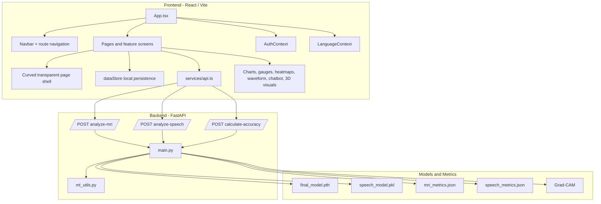

# NeuroSense AI Architecture Flowchart

## Current Application Architecture

## Notes

### Frontend

- React Router manages page navigation
- `AuthContext` manages demo authentication state
- `LanguageContext` manages English/Hindi UI selection
- `PageShell` provides the shared curved transparent layout
- `dataStore` persists longitudinal data in `localStorage`

### Backend

- FastAPI exposes inference and score-calculation endpoints
- MRI inference uses PyTorch + torchvision + Grad-CAM
- Speech inference uses librosa feature extraction and a serialized model

### Data Path

1. User input is collected in the frontend
2. Relevant files or scores are sent to FastAPI
3. The backend returns predictions and metadata
4. The frontend stores results locally
5. Dashboard and reports rebuild the user timeline from stored results
