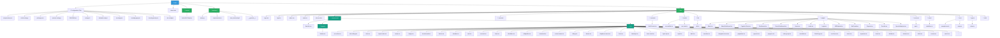

# Code Folder Structure Flowchart

## Complete Hierarchy of Code Directory

```mermaid
graph TD
    A["Code/"]
    
    A --> B["📄 Configuration Files"]
    B --> B1["components.json"]
    B --> B2["eslint.config.js"]
    B --> B3["package.json"]
    B --> B4["postcss.config.js"]
    B --> B5["README.md"]
    B --> B6["setup.ps1"]
    B --> B7["tailwind.config.ts"]
    B --> B8["tsconfig.json"]
    B --> B9["tsconfig.app.json"]
    B --> B10["tsconfig.node.json"]
    B --> B11["vite.config.ts"]
    
    A --> C["index.html"]
    
    A --> D["📁 assets/"]
    D --> D1["index-BtLPNaqV.js"]
    
    A --> E["📁 backend/"]
    E --> E1["main.py"]
    E --> E2["requirements.txt"]
    E --> E3["start_backend.ps1"]
    E --> E4["__pycache__/"]
    
    A --> F["📁 src/"]
    F --> F1["App.css"]
    F --> F2["App.tsx"]
    F --> F3["index.css"]
    F --> F4["main.tsx"]
    F --> F5["vite-env.d.ts"]
    
    F --> F6["📁 components/"]
    F6 --> F6A["NavLink.tsx"]
    F6 --> F6B["📁 layouts/"]
    F6B --> F6B1["Navbar.tsx"]
    F6 --> F6C["📁 ui/"]
    F6C --> F6C1["accordion.tsx"]
    F6C --> F6C2["alert-dialog.tsx"]
    F6C --> F6C3["alert.tsx"]
    F6C --> F6C4["aspect-ratio.tsx"]
    F6C --> F6C5["avatar.tsx"]
    F6C --> F6C6["badge.tsx"]
    F6C --> F6C7["breadcrumb.tsx"]
    F6C --> F6C8["button.tsx"]
    F6C --> F6C9["calendar.tsx"]
    F6C --> F6C10["card.tsx"]
    F6C --> F6C11["carousel.tsx"]
    F6C --> F6C12["chart.tsx"]
    F6C --> F6C13["checkbox.tsx"]
    F6C --> F6C14["collapsible.tsx"]
    F6C --> F6C15["command.tsx"]
    F6C --> F6C16["context-menu.tsx"]
    F6C --> F6C17["dialog.tsx"]
    F6C --> F6C18["drawer.tsx"]
    F6C --> F6C19["dropdown-menu.tsx"]
    F6C --> F6C20["form.tsx"]
    F6C --> F6C21["Heatmap.tsx"]
    F6C --> F6C22["hover-card.tsx"]
    F6C --> F6C23["input-otp.tsx"]
    F6C --> F6C24["input.tsx"]
    F6C --> F6C25["label.tsx"]
    F6C --> F6C26["menubar.tsx"]
    F6C --> F6C27["navigation-menu.tsx"]
    F6C --> F6C28["pagination.tsx"]
    F6C --> F6C29["popover.tsx"]
    F6C --> F6C30["progress.tsx"]
    F6C --> F6C31["radio-group.tsx"]
    F6C --> F6C32["resizable.tsx"]
    F6C --> F6C33["RiskGauge.tsx"]
    F6C --> F6C34["scroll-area.tsx"]
    F6C --> F6C35["select.tsx"]
    F6C --> F6C36["separator.tsx"]
    F6C --> F6C37["sheet.tsx"]
    F6C --> F6C38["sidebar.tsx"]
    F6C --> F6C39["skeleton.tsx"]
    F6C --> F6C40["slider.tsx"]
    F6C --> F6C41["sonner.tsx"]
    F6C --> F6C42["switch.tsx"]
    F6C --> F6C43["..."]
    
    F --> F7["📁 contents/"]
    
    F --> F8["📁 contexts/"]
    F8 --> F8A["AuthContext.tsx"]
    
    F --> F9["📁 hooks/"]
    F9 --> F9A["use-mobile.tsx"]
    F9 --> F9B["use-toast.ts"]
    
    F --> F10["📁 lib/"]
    F10 --> F10A["utils.ts"]
    
    F --> F11["📁 pages/"]
    F11 --> F11A["About.tsx"]
    F11 --> F11B["AdminDashboard.tsx"]
    F11 --> F11C["CognitiveTests.tsx"]
    F11 --> F11D["Dashboard.tsx"]
    F11 --> F11E["DoctorDashboard.tsx"]
    F11 --> F11F["Home.tsx"]
    F11 --> F11G["Index.tsx"]
    F11 --> F11H["Login.tsx"]
    F11 --> F11I["MRIUpload.tsx"]
    F11 --> F11J["NotFound.tsx"]
    F11 --> F11K["Reports.tsx"]
    F11 --> F11L["Results.tsx"]
    F11 --> F11M["SpeechAnalysis.tsx"]
    
    F --> F12["📁 services/"]
    F12 --> F12A["api.ts"]
    
    F --> F13["📁 store/"]
    F13 --> F13A["dataStore.ts"]
    
    F --> F14["📁 test/"]
    F14 --> F14A["example.test.ts"]
    F14 --> F14B["setup.ts"]
    
    F --> F15["📁 types/"]
    F15 --> F15A["index.ts"]
    
    F --> F16["📁 utils/"]
    
    style A fill:#3498db,stroke:#2c3e50,color:#fff
    style D fill:#27ae60,stroke:#2c3e50,color:#fff
    style E fill:#27ae60,stroke:#2c3e50,color:#fff
    style F fill:#27ae60,stroke:#2c3e50,color:#fff
    style F6 fill:#16a085,stroke:#2c3e50,color:#fff
    style F6B fill:#16a085,stroke:#2c3e50,color:#fff
    style F6C fill:#16a085,stroke:#2c3e50,color:#fff
```
