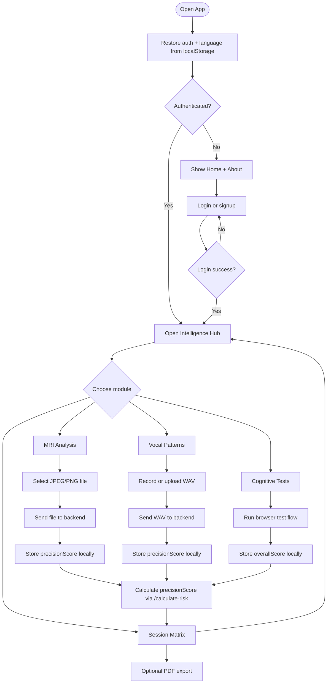

# NeuroSense AI Pseudo Code Flowchart

## End-To-End User Logic



## Simplified Pseudo Code

```text
onAppLoad:
  restoreUser()
  restoreLanguage()

if userIsAuthenticated:
  showDashboard()
else:
  showPublicPages()

onMRIUpload:
  if fileIsJPEGorPNG:
    sendImageToBackend()
    receiveClassificationAndHeatmap() # Returns precisionScore keyword
    saveMRIResult()
  else:
    showError("Invalid format")

onSpeechUpload:
  if fileIsWAV:
    sendAudioToBackend()
    receiveFeaturesAndClassification() # Returns precisionScore keyword
    saveSpeechResult()
  else:
    showError("Invalid format")

onCognitiveCompletion:
  computeCognitiveScore()
  saveCognitiveResult()

onFusionRequest:
  sendMRI(precisionScore) + speech(precisionScore) + cognitive(overallScore)
  receiveOverallRisk() # Computed as (MRI*0.45 + Speech*0.25 + Cognitive*0.30)
  saveAssessment()

onReportExport:
  generatePDF() # Exports "Precision" telemetry in table rows
```
