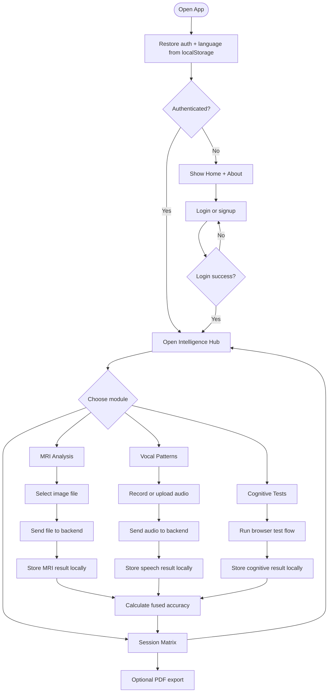

# NeuroSense AI Pseudo Code Flowchart

## End-To-End User Logic



## Simplified Pseudo Code

```text
onAppLoad:
  restoreUser()
  restoreLanguage()

if userIsAuthenticated:
  showDashboard()
else:
  showPublicPages()

onMRIUpload:
  sendImageToBackend()
  receiveClassificationAndHeatmap()
  saveMRIResult()

onSpeechUpload:
  sendAudioToBackend()
  receiveFeaturesAndClassification()
  saveSpeechResult()

onCognitiveCompletion:
  computeCognitiveScore()
  saveCognitiveResult()

onFusionRequest:
  sendMRI + speech + cognitive scores
  receiveOverallAccuracy()
  saveAssessment()

onReportExport:
  generatePDF()
```
