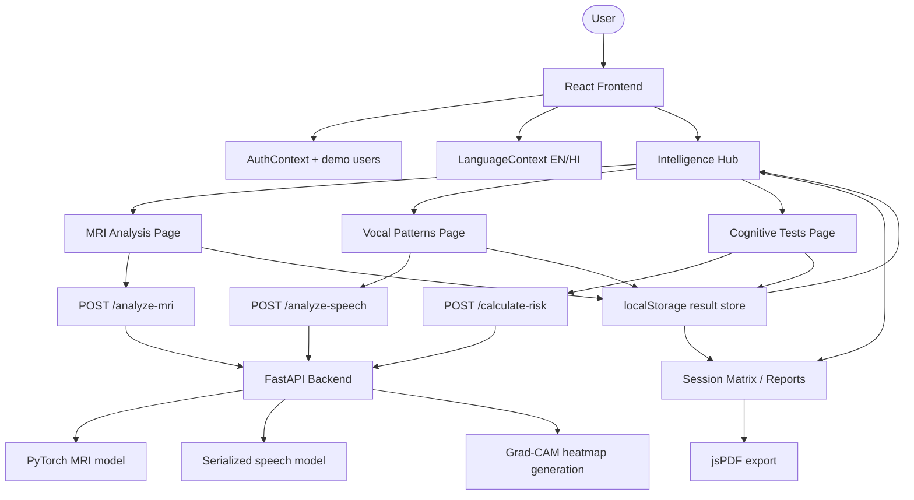

# NeuroLab Application Workflow

NeuroLab is a multimodal dementia risk assessment application with a React frontend and a FastAPI backend. The app supports English/Hindi UI switching, curved transparent page shells, and longitudinal result tracking in the browser.

## High-Level Flow

1. User opens the frontend
2. Auth state is restored from local storage
3. User navigates into MRI, speech, cognitive, or report workflows
4. MRI and speech modules call the FastAPI backend
5. Cognitive testing is computed in the frontend flow
6. Fused assessment data is stored locally and visualized in the dashboard
7. Reports can be exported to PDF

## Workflow Diagram

## Frontend Responsibilities

- Routing and protected pages
- Demo authentication
- English/Hindi language switching
- Transparent dashboard shell and visual presentation
- Upload forms and audio recording (WAV format validation)
- Local result persistence in `localStorage`
- Charts, gauges, waveforms, and report export

## Backend Responsibilities

- MRI image inference (JPEG/PNG only)
- Speech feature extraction and inference (WAV input only)
- Grad-CAM heatmap generation
- Weighted fused score calculation (Precision-based)

## Module Summary

### MRI Analysis

- Upload JPEG/PNG scan
- Backend returns precisionScore, classification, metadata, findings, and heatmap data

### Vocal Patterns

- Record or upload WAV audio
- Backend returns acoustic features, transcript-style findings, waveform data, and classification (Precision-based)

### Cognitive Tests

- Run browser-based interaction flow
- Compute session score
- Feed final values into fused risk calculation via backend

### Intelligence Hub

- Show latest module precision scores
- Show longitudinal charts for Risk and MRI signals
- Show latest fused status (Low/Moderate/High)

### Session Matrix

- List detailed logs of all diagnostic cycles
- Export PDF summaries including precision telemetry
